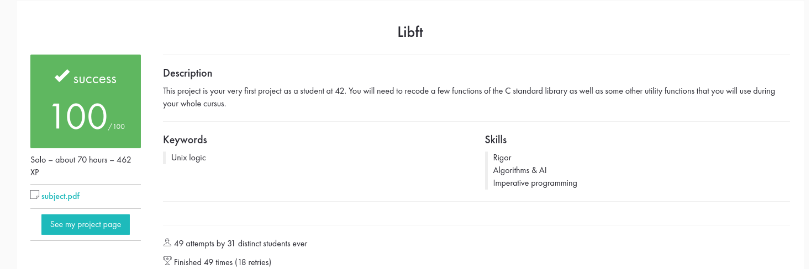

# LIBRARY FORTY-TWO (LIBFT)
## A libft é uma biblioteca personalizada de funções em C desenvolvida como parte do currículo da 42. Este projeto tem como objetivo recriar funções da biblioteca padrão do C e implementar funções adicionais úteis para futuros projetos.

### Data de início:
Eu iniciei o trabalho na libft dia 14 de Outubro de 2024.
### Data de entrega:
Validei o projeto no dia 9 de Novembro de 2024.

